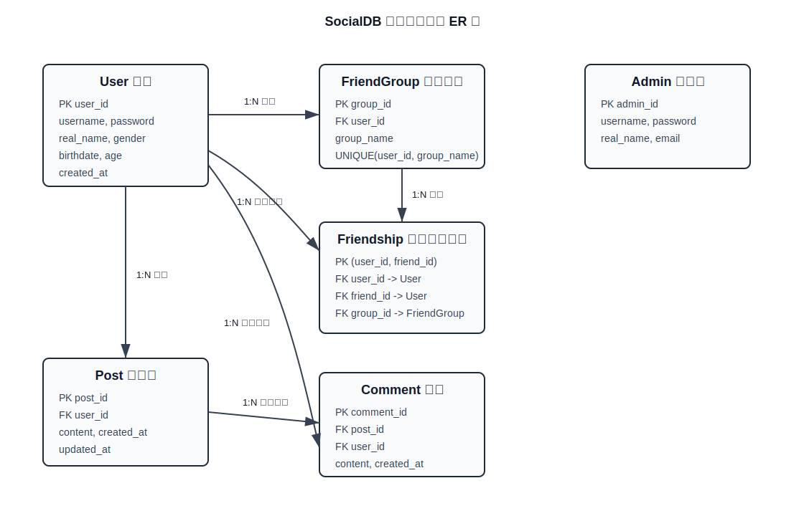

# 实验五 数据库应用开发大作业精简报告

## 1. 系统总体设计

本实验实现一个基于 MySQL 的命令行社交网络平台，数据库名为 `SocialDB`。系统包含普通用户和管理员两类角色。普通用户可以注册、登录、修改个人信息、搜索用户、管理好友和好友分组、发布/修改/删除朋友圈、查看好友朋友圈并评论；管理员可以登录、修改个人信息、注销用户、浏览所有朋友圈并审核删除朋友圈。

程序启动后先进入总菜单，用户可选择“初始化/重置数据库”或“启动系统”。初始化操作会执行 `init_db.sql` 并重建数据库；普通启动不会清空已有数据。

程序文件说明：

| 文件 | 说明 |
| --- | --- |
| `lab5.py` | 主程序，包含菜单交互、业务逻辑、事务和异常处理 |
| `init_db.sql` | 数据库初始化脚本，包含建库、建表、约束、视图、触发器和测试数据 |
| `requirements.txt` | Python 依赖，仅包含 `mysql-connector-python` |
| `Lab5_ER图.svg` | ER 图 |

## 2. ER 图

ER 图文件为 `Lab5_ER图.svg`，实体和关系如下：



核心关系：

- `User` 与 `FriendGroup`：一对多，一个用户可创建多个好友分组。
- `User` 与 `Friendship`：一对多，好友关系业务上为双向；程序添加好友时同时插入 `A->B` 和 `B->A` 两条记录。
- `FriendGroup` 与 `Friendship`：一对多，一个分组可包含多个好友关系。
- `User` 与 `Post`：一对多，一个用户可发布多条朋友圈。
- `Post` 与 `Comment`：一对多，一条朋友圈可拥有多条评论。
- `User` 与 `Comment`：一对多，一个用户可发表多条评论。

## 3. 表结构设计

### 3.1 Admin 管理员表

| 字段 | 类型 | 约束 | 说明 |
| --- | --- | --- | --- |
| `admin_id` | `INT` | PK, AUTO_INCREMENT | 管理员编号 |
| `username` | `VARCHAR(30)` | NOT NULL, UNIQUE | 管理员账号 |
| `password` | `CHAR(64)` | NOT NULL | SHA-256 哈希密码 |
| `real_name` | `VARCHAR(20)` |  | 管理员姓名 |
| `email` | `VARCHAR(50)` |  | 邮箱 |

### 3.2 User 用户表

| 字段 | 类型 | 约束 | 说明 |
| --- | --- | --- | --- |
| `user_id` | `INT` | PK, AUTO_INCREMENT | 用户编号 |
| `username` | `VARCHAR(30)` | NOT NULL, UNIQUE | 用户账号 |
| `password` | `CHAR(64)` | NOT NULL | SHA-256 哈希密码 |
| `real_name` | `VARCHAR(20)` |  | 真实姓名 |
| `gender` | `ENUM('M','F','Other')` |  | 性别 |
| `birthdate` | `DATE` |  | 出生日期 |
| `age` | `INT` | CHECK 0-150 | 年龄 |
| `created_at` | `DATETIME` | DEFAULT CURRENT_TIMESTAMP | 注册时间 |

### 3.3 FriendGroup 好友分组表

| 字段 | 类型 | 约束 | 说明 |
| --- | --- | --- | --- |
| `group_id` | `INT` | PK, AUTO_INCREMENT | 分组编号 |
| `user_id` | `INT` | FK -> User(user_id), NOT NULL | 分组所属用户 |
| `group_name` | `VARCHAR(30)` | NOT NULL | 分组名称 |

补充约束：`UNIQUE(user_id, group_name)`，防止同一用户创建同名分组。

### 3.4 Friendship 好友关系表

| 字段 | 类型 | 约束 | 说明 |
| --- | --- | --- | --- |
| `user_id` | `INT` | PK, FK -> User(user_id) | 当前用户 |
| `friend_id` | `INT` | PK, FK -> User(user_id) | 当前用户的好友 |
| `group_id` | `INT` | FK -> FriendGroup(group_id) | 好友所属分组，可为空 |
| `created_at` | `DATETIME` | DEFAULT CURRENT_TIMESTAMP | 添加时间 |

补充约束：复合主键 `(user_id, friend_id)` 避免重复好友关系；`CHECK(user_id <> friend_id)` 防止添加自己为好友。业务上好友关系为双向，程序会同时维护正反两条记录。

### 3.5 Post 朋友圈表

| 字段 | 类型 | 约束 | 说明 |
| --- | --- | --- | --- |
| `post_id` | `INT` | PK, AUTO_INCREMENT | 朋友圈编号 |
| `user_id` | `INT` | FK -> User(user_id), NOT NULL | 发布者 |
| `content` | `VARCHAR(500)` | NOT NULL, CHECK <= 500 | 朋友圈内容 |
| `created_at` | `DATETIME` | DEFAULT CURRENT_TIMESTAMP | 发布时间 |
| `updated_at` | `DATETIME` | DEFAULT CURRENT_TIMESTAMP ON UPDATE | 最近更新时间 |

### 3.6 Comment 评论表

| 字段 | 类型 | 约束 | 说明 |
| --- | --- | --- | --- |
| `comment_id` | `INT` | PK, AUTO_INCREMENT | 评论编号 |
| `post_id` | `INT` | FK -> Post(post_id), NOT NULL | 被评论的朋友圈 |
| `user_id` | `INT` | FK -> User(user_id), NOT NULL | 评论用户 |
| `content` | `VARCHAR(200)` | NOT NULL, CHECK <= 200 | 评论内容 |
| `created_at` | `DATETIME` | DEFAULT CURRENT_TIMESTAMP | 评论时间 |

## 4. 完整性约束与安全设计

数据库端约束：

- 主键约束：每张表均有主键，`Friendship` 使用复合主键。
- 唯一约束：管理员账号、用户账号唯一；同一用户的好友分组名唯一。
- 外键约束：好友、分组、朋友圈、评论均通过外键维护引用完整性。
- 级联删除：管理员注销用户时删除 `User` 记录，外键 `ON DELETE CASCADE` 自动删除其分组、好友关系、朋友圈和评论；删除朋友圈时自动删除评论。
- CHECK 约束：年龄范围、朋友圈长度、评论长度、自加好友限制。
- 枚举约束：用户性别限定为 `M/F/Other`。

程序端约束：

- 使用参数化 SQL，避免 SQL 注入。
- 密码使用 SHA-256 哈希后保存和验证。
- 校验空用户名、空密码、年龄范围、日期格式、朋友圈长度、评论长度。
- 添加好友时校验目标用户是否存在、是否为自己、是否重复添加，并同时维护双向好友关系。
- 移动好友分组时校验目标用户确实是当前用户好友，并校验分组属于当前用户。
- 评论时限制只能评论好友的朋友圈。
- 用户只能修改、删除自己的朋友圈。

## 5. 视图设计

系统创建视图 `FriendPostView`，用于查看好友朋友圈：

```sql
CREATE VIEW FriendPostView AS
SELECT
    f.user_id AS viewer_id,
    u.username AS author_username,
    p.post_id,
    p.content,
    p.created_at,
    p.updated_at
FROM Friendship f
JOIN Post p ON p.user_id = f.friend_id
JOIN User u ON u.user_id = f.friend_id;
```

该视图将好友关系与朋友圈连接起来，用户菜单中的“查看好友朋友圈”直接基于该视图查询，并按最近更新时间排序。

## 6. 事务设计

系统在涉及多表一致性或关键写操作时使用事务：

| 功能 | 事务作用 |
| --- | --- |
| 添加好友 | 同时插入双向好友关系，失败回滚 |
| 删除好友 | 同时删除双向好友关系，失败回滚 |
| 删除朋友圈 | 删除朋友圈及其评论需要保持一致 |
| 管理员注销用户 | 删除用户记录，事务保证原子性，外键级联清理相关数据 |
| 管理员删除朋友圈 | 审核删除朋友圈及评论，失败回滚 |

程序中通过 `conn.start_transaction()` 开启事务，成功后 `commit()`，异常时 `rollback()`。

## 7. 触发器设计

系统创建触发器 `trg_delete_post_comments`，用于删除朋友圈时自动删除其评论：

```sql
DELIMITER $$
CREATE TRIGGER trg_delete_post_comments
BEFORE DELETE ON Post
FOR EACH ROW
BEGIN
    DELETE FROM Comment WHERE post_id = OLD.post_id;
END$$
DELIMITER ;
```

该触发器体现数据库自动维护相关数据的能力。`Comment.post_id` 外键的 `ON DELETE CASCADE` 也提供了后备保障。

## 8. 功能完成情况

### 用户端

- 注册：完成，自动生成用户 ID，密码哈希保存。
- 登录：完成，验证用户名和密码。
- 修改资料：完成，支持姓名、性别、出生日期、年龄。
- 搜索用户：完成，按用户名关键词搜索用户。
- 好友管理：完成，支持添加、删除双向好友关系。
- 好友分组：完成，支持新建分组、移动好友到分组。
- 朋友圈管理：完成，支持发布、查看、修改、删除自己的朋友圈。
- 查看好友朋友圈：完成，显示好友帖子、发布时间、更新时间和评论。
- 评论：完成，只允许评论好友朋友圈。

### 管理员端

- 登录：完成。
- 修改管理员信息：完成。
- 注销用户：完成，事务删除用户记录，并通过外键级联清理相关好友、分组、朋友圈和评论。
- 浏览朋友圈：完成，只查询并显示 `Post` 表中的帖子 ID、内容、发布时间和更新时间，不查询用户名、真实姓名、年龄、性别、出生日期等用户个人字段。
- 审核删除朋友圈：完成，删除帖子并同步清理评论。

## 9. 异常处理

系统对数据库连接失败、SQL 执行失败、非法输入、空内容、越权操作、重复好友关系、非法分组等情况均给出提示。数据库初始化失败时程序直接退出，避免在数据库不可用状态下继续运行。

## 10. 小组分工

本实验按单人完成记录：

| 工作内容 | 完成人 |
| --- | --- |
| 数据库表结构、约束、视图、触发器设计 | 滕飞 |
| Python 主程序、用户功能、好友功能、朋友圈功能、管理员功能 | 滕飞/蔡纪坤 |
| 输入校验、异常处理、测试与报告整理 | 蔡纪坤 |

正式提交时请在此处补充姓名、学号、班级等个人信息。
